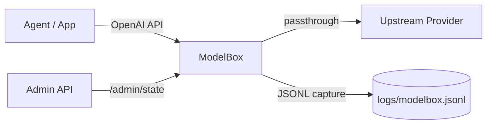

<p align="center">
  <h1 align="center">ModelBox</h1>
  <p align="center">OpenAI-protocol proxy for context debugging, traffic capture, and safe mocking.</p>
</p>

<p align="center">
  <a href="./README.md"></a>
  <a href="./README.zh-CN.md"></a>
</p>

<p align="center">
  =22" src="https://img.shields.io/badge/Node-%3E%3D22-339933?logo=node.js&logoColor=white">
  
  
</p>

## Why ModelBox

ModelBox sits between your agent and model provider so you can inspect what is actually sent to the model.

- Capture full request/response payloads as JSONL with `traceId`
- Switch between `mock` and `passthrough` without restarting
- Keep OpenAI-compatible clients unchanged (`/v1/responses`, `/v1/chat/completions`)
- Debug context safely without polluting upstream model behavior

## Features

| Capability | Description |
|---|---|
| OpenAI-compatible endpoints | `POST /v1/responses`, `POST /v1/chat/completions`, `GET /v1/models` |
| Runtime control | `GET/POST /admin/state` to switch mode, capture, upstream |
| Structured logs | JSONL records for request/response with digest and summary |
| Mock mode | Returns deterministic `DEBUG_CONTEXT_SUMMARY {...}` output |
| Passthrough mode | Relays traffic to your real upstream model provider |

## Architecture


```mermaid
flowchart LR
  A[Agent / App] -->|OpenAI API| B[ModelBox]
  B -->|passthrough| C[Upstream Provider]
  B -->|JSONL capture| D[(logs/modelbox.jsonl)]
  E[Admin API] -->|/admin/state| B
```

## Quick Start

### 1. Start in mock mode

```bash
MODELBOX_MODE=mock npm start
```

Default bind: `127.0.0.1:8787`.

### 2. Start in passthrough mode

```bash
MODELBOX_MODE=passthrough \
MODELBOX_UPSTREAM_BASE_URL=https://api.openai.com \
MODELBOX_UPSTREAM_API_KEY="$OPENAI_API_KEY" \
npm start
```

Note: `MODELBOX_UPSTREAM_BASE_URL` should be provider root URL (for OpenAI use `https://api.openai.com`, not `/v1`).

### 3. Gemini (OpenAI-compatible endpoint)

Gemini's OpenAI-compatible endpoint usually expects `/chat/completions` (without local `/v1` prefix).  
Use `MODELBOX_UPSTREAM_STRIP_PREFIX=/v1` so ModelBox rewrites `/v1/chat/completions` to `/chat/completions` upstream.

```bash
MODELBOX_MODE=passthrough \
MODELBOX_UPSTREAM_BASE_URL=https://generativelanguage.googleapis.com/v1beta/openai \
MODELBOX_UPSTREAM_API_KEY="$GEMINI_API_KEY" \
MODELBOX_UPSTREAM_STRIP_PREFIX=/v1 \
npm start
```

## OpenClaw Integration

### Configure provider

```bash
openclaw config set models.providers.modelbox --json '{
  "baseUrl": "http://127.0.0.1:8787/v1",
  "api": "openai-responses",
  "apiKey": "modelbox-local",
  "models": [
    {
      "id": "debug-model",
      "name": "debug-model",
      "reasoning": false,
      "input": ["text", "image"],
      "cost": { "input": 0, "output": 0, "cacheRead": 0, "cacheWrite": 0 },
      "contextWindow": 1000000,
      "maxTokens": 131072
    }
  ]
}'
```

### Switch to ModelBox in current session

```bash
/model modelbox/debug-model
# or
/new modelbox/debug-model
```

If you use `agents.defaults.models` allowlist, include `modelbox/debug-model` there so `/model` and session overrides can use it.

## Generic Integration (Any Agent)

1. Set base URL to `http://127.0.0.1:8787/v1`
2. Keep your OpenAI-compatible SDK/client unchanged
3. Use `MODELBOX_MODE=mock` for local context debugging
4. Use `MODELBOX_MODE=passthrough` for transparent relay

## Admin API

### Read state

```bash
curl -s http://127.0.0.1:8787/admin/state
```

### Update state at runtime

```bash
curl -s -X POST http://127.0.0.1:8787/admin/state \
  -H 'Content-Type: application/json' \
  -d '{
    "mode": "passthrough",
    "capture": true,
    "upstreamBaseUrl": "https://api.openai.com",
    "upstreamStripPrefix": "",
    "maxCaptureBytes": 4194304
  }'
```

If `MODELBOX_ADMIN_TOKEN` is configured, pass:

```bash
-H 'Authorization: Bearer <token>'
```

## Environment Variables

| Variable | Default | Description |
|---|---|---|
| `MODELBOX_BIND` | `127.0.0.1` | Bind address |
| `MODELBOX_PORT` | `8787` | Listen port |
| `MODELBOX_MODE` | `passthrough` | `mock` or `passthrough` |
| `MODELBOX_CAPTURE` | `true` | Enable JSONL capture |
| `MODELBOX_LOG_FILE` | `./logs/modelbox.jsonl` | Log output file |
| `MODELBOX_MAX_CAPTURE_BYTES` | `2097152` | Max captured response bytes |
| `MODELBOX_UPSTREAM_BASE_URL` | empty | Upstream base URL (required in passthrough) |
| `MODELBOX_UPSTREAM_API_KEY` | empty | Optional upstream API key override |
| `MODELBOX_UPSTREAM_STRIP_PREFIX` | empty | Optional path prefix stripped before forwarding (for example `/v1`) |
| `MODELBOX_ADMIN_TOKEN` | empty | Optional admin API token |

Capture logs are written to `MODELBOX_LOG_FILE` (default `./logs/modelbox.jsonl`), resolved relative to the process working directory.

Backward compatibility: legacy `SIDECAR_*` variables are still accepted.

## Log Format

Each JSONL line includes key fields such as:

- `traceId`
- `direction` (`request` or `response`)
- `mode` (`mock` or `passthrough`)
- `path`, `method`, `status`
- `summary` (`messageCount`, `roles`, `toolsCount`, `imagesCount`, `promptChars`, `promptTokensApprox`)
- `body` and `bodySha256`

Mock output text is intentionally compact:

```text
DEBUG_CONTEXT_SUMMARY {...}
```

## Prompt Breakdown Script

Use the built-in analyzer to split a captured request into major prompt blocks and estimate token cost per block.

```bash
npm run analyze:prompt -- --file logs/modelbox.jsonl
```

Useful options:

- `--traceId <id>`: analyze one trace directly
- `--index <n>`: pick a request record by index (`-1` = latest)
- `--json`: machine-readable output

## Advanced Analyzer (Python)

For multi-record summary, tool-by-tool schema size breakdown, and cross-request diffing, use the Python analyzer under [`tools/`](./tools/README.md):

```bash
python3 tools/analyze.py logs/modelbox.jsonl            # overview of every record
python3 tools/analyze.py logs/modelbox.jsonl tokens 0   # token distribution bar chart
python3 tools/analyze.py logs/modelbox.jsonl tools 0    # tools sorted by schema size + % of total
python3 tools/analyze.py logs/modelbox.jsonl diff 0 1   # compare two requests (prefix-cache check)
python3 tools/analyze.py logs/modelbox.jsonl extract 0  # dump system/messages/tools to files
```

Unlike `summary.promptTokensApprox` (which only counts `messages`), this analyzer also measures the `tools` field — in modern agents the tools schema often equals or exceeds the system prompt in size. See [`tools/README.md`](./tools/README.md) for all commands and examples.
