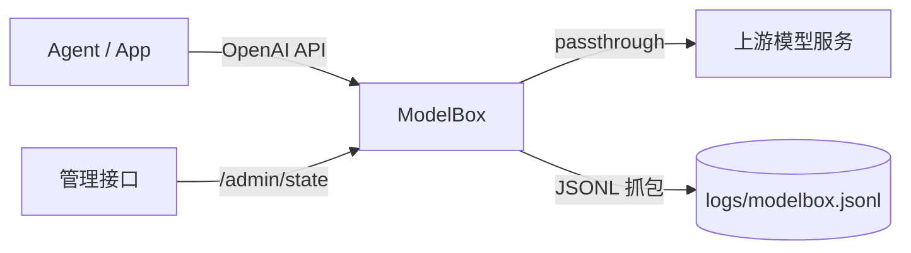

<p align="center">
  <h1 align="center">ModelBox</h1>
  <p align="center">用于上下文调试、流量抓包与安全 Mock 的 OpenAI 协议代理。</p>
</p>

<p align="center">
  <a href="./README.md"></a>
  <a href="./README.zh-CN.md"></a>
</p>

<p align="center">
  =22" src="https://img.shields.io/badge/Node-%3E%3D22-339933?logo=node.js&logoColor=white">
  
  
</p>

## 为什么用 ModelBox

ModelBox 放在 Agent 和模型服务商之间，让你看到“真正送给模型的内容”。

- 全量请求/响应按 JSONL 落盘，并带 `traceId`
- `mock` 与 `passthrough` 运行时可切换，无需重启
- 保持 OpenAI 兼容接口，不用改客户端调用方式
- 调试上下文时不污染上游模型真实行为

## 功能

| 能力 | 说明 |
|---|---|
| OpenAI 兼容接口 | `POST /v1/responses`、`POST /v1/chat/completions`、`GET /v1/models` |
| 运行时控制 | `GET/POST /admin/state` 动态切换模式、抓包、上游配置 |
| 结构化日志 | 请求/响应统一 JSONL，包含摘要与摘要哈希 |
| Mock 模式 | 固定返回 `DEBUG_CONTEXT_SUMMARY {...}` |
| 透传模式 | 无缝转发到真实上游模型服务 |

## 架构



## 快速开始

### 1. Mock 模式启动

```bash
cd tools/modelbox
MODELBOX_MODE=mock npm start
```

默认监听：`127.0.0.1:8787`。

### 2. 透传模式启动

```bash
cd tools/modelbox
MODELBOX_MODE=passthrough \
MODELBOX_UPSTREAM_BASE_URL=https://api.openai.com \
MODELBOX_UPSTREAM_API_KEY="$OPENAI_API_KEY" \
npm start
```

注意：`MODELBOX_UPSTREAM_BASE_URL` 应该填服务根地址。OpenAI 场景请用 `https://api.openai.com`，不要带 `/v1`。

## OpenClaw 接入

### 配置 provider

```bash
openclaw config set models.providers.modelbox --json '{
  "baseUrl": "http://127.0.0.1:8787/v1",
  "api": "openai-responses",
  "apiKey": "modelbox-local",
  "models": [
    {
      "id": "debug-model",
      "name": "debug-model",
      "reasoning": false,
      "input": ["text", "image"],
      "cost": { "input": 0, "output": 0, "cacheRead": 0, "cacheWrite": 0 },
      "contextWindow": 200000,
      "maxTokens": 8192
    }
  ]
}'
```

### 设置为默认模型

```bash
openclaw config set agents.defaults.model.primary "modelbox/debug-model"
```

如果你启用了 `agents.defaults.models` 白名单，记得把 `modelbox/debug-model` 加进去。

## 其他 Agent 通用接入

1. 把 base URL 指向 `http://127.0.0.1:8787/v1`
2. 保持现有 OpenAI SDK/客户端调用不变
3. 本地调试上下文用 `MODELBOX_MODE=mock`
4. 透明转发真实调用用 `MODELBOX_MODE=passthrough`

## 管理接口

### 查看当前状态

```bash
curl -s http://127.0.0.1:8787/admin/state
```

### 运行时更新状态

```bash
curl -s -X POST http://127.0.0.1:8787/admin/state \
  -H 'Content-Type: application/json' \
  -d '{
    "mode": "passthrough",
    "capture": true,
    "upstreamBaseUrl": "https://api.openai.com",
    "maxCaptureBytes": 4194304
  }'
```

如果设置了 `MODELBOX_ADMIN_TOKEN`，需要加：

```bash
-H 'Authorization: Bearer <token>'
```

## 环境变量

| 变量 | 默认值 | 说明 |
|---|---|---|
| `MODELBOX_BIND` | `127.0.0.1` | 监听地址 |
| `MODELBOX_PORT` | `8787` | 监听端口 |
| `MODELBOX_MODE` | `passthrough` | `mock` 或 `passthrough` |
| `MODELBOX_CAPTURE` | `true` | 是否开启 JSONL 抓包 |
| `MODELBOX_LOG_FILE` | `./logs/modelbox.jsonl` | 抓包日志文件 |
| `MODELBOX_MAX_CAPTURE_BYTES` | `2097152` | 响应抓包最大字节数 |
| `MODELBOX_UPSTREAM_BASE_URL` | 空 | 上游服务根地址（透传模式必填） |
| `MODELBOX_UPSTREAM_API_KEY` | 空 | 可选，上游 API Key 覆盖 |
| `MODELBOX_ADMIN_TOKEN` | 空 | 可选，管理接口鉴权令牌 |

兼容说明：旧的 `SIDECAR_*` 变量仍然可用。

## 日志格式

每条 JSONL 记录会包含：

- `traceId`
- `direction`（`request` 或 `response`）
- `mode`（`mock` 或 `passthrough`）
- `path`、`method`、`status`
- `summary`（`messageCount`、`roles`、`toolsCount`、`imagesCount`、`promptChars`）
- `body` 与 `bodySha256`

Mock 模式下输出文本是紧凑摘要：

```text
DEBUG_CONTEXT_SUMMARY {...}
```
